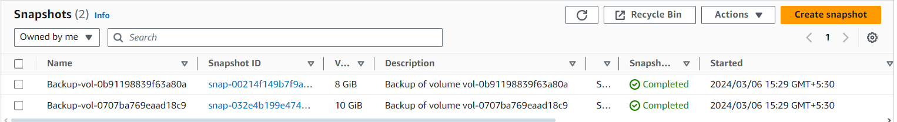
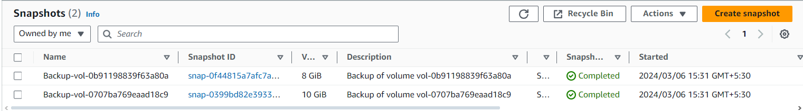

# Automated snapshots of EBS volumes

*1. Create a role and attach the inline policy which is given in repo - policy.json* 

*2. Create the lambda function using python as runtime and attach the role created in the previous step* 

*3. Use the lambda function provided in the repo - volume-snapshot.py* 

*4. This function will check for any snapshot is already created for a volume if it is created already this function will delete the old version of the snapshot to create the new one. if no snapshot is created yet it will create the new one* 

*We can see from the below snap these were the snapshots created at 15:29* 

*New version of the snapshot*

